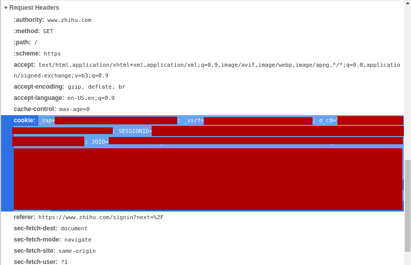

# Dedeleted

中文社交平台转载/备份 Bot

## 基本功能

Dedeleted 是个 [Inline Bot](https://core.telegram.org/bots/inline)，可以直接通过下列方式使用（不区分大小写）：

```
@DedeletedBot url
```

将中文社交平台上的文章备份并转载到 [Telegram](https://telegram.org/) 平台上。给 Dedeleted 一个内容的链接 `url`，回复转发的内容。

也可以将 `url` 直接私信发给本 Bot。

目前支持的平台和内容见下表：

| 平台 | 备份文字/图片 | 备份视频 | 免登录
|:---:|:---:|:---:|:---:|
| [微博](#weibo) | ✓ | ✓ | ⍻ | 
| [知乎](#zhihu) | ✓ | ✗ | ✗ |
| [微信](#wechat) | ✓ | ✗ | ✓ |
| [任意媒体链接](#media) | ✓ | ✓ | ✓ |

注意：文字与图片会被转载在 [Telegra.ph](https://telegra.ph) 上，超过一定长度的内容可能被分成多篇备份；视频都会以 Telegram 消息的形式发送，但有 50MB 的大小限制。

将来会考虑加入豆瓣小组帖子和微博文章等内容。

### <a name="weibo"></a> 微博

[微博](https://weibo.com)。

支持网页版、手机版或是手机国际版的分享链接例如：

```
@DedeletedBot https://weibo.com/2803301701/JummswXqm
@DedeletedBot https://m.weibo.cn/detail/4572358007854926
@DedeletedBot http://weibointl.api.weibo.com/share/184529863.html?weibo_id=4572358007854926
```

视频会以 Telegram 消息的形式发送，但有 50MB 的大小限制。

部分内容需要登录才能获取，暂不支持微博文章。

### <a name="zhihu"></a> 知乎

[知乎](https://www.zhihu.com)回答和专栏文章，链接格式：

```
@DedeletedBot https://www.zhihu.com/question/395525046/answer/1284606651
@DedeletedBot https://www.zhihu.com/answer/1284606651
@DedeletedBot https://zhuanlan.zhihu.com/p/89274560
```

暂不支持内容中的视频，暂不支持知乎想法。必须登录。

### <a name="wechat"></a> 微信

[微信](https://mp.weixin.qq.com)公众号的文章，链接格式：

```
@DedeletedBot https://mp.weixin.qq.com/s/NnmgcJRAurTsCxTbCo7Mmw
```

暂不支持转发视频，无需登录。

### <a name="media"></a> 任意媒体链接

任何无需登录即可访问的图片/视频的外网链接，例如

```
@DedeletedBot https://wx3.sinaimg.cn/images/default_d_h_mw690.gif
@DedeletedBot https://www.apple.com/105/media/us/iphone-12-pro/2020/e70ffbd8-50f1-40f3-ac36-0f03a15ac314/anim/hero/large.mp4
```

媒体文件也都有 50MB 的大小限制。

## <a name="setup"></a>设置

所有设置用命令均需要私信直接发送给本 Bot。

### 启用或禁用 Dedeleted

可以直接在聊天框中使用，无需设置。

### 获取 Telegra.ph 帐号

本 Bot 会为每个用户自动建立一个 Telegra.ph 帐号，用来发表转发的文章。如果你需要获取这个帐号的信息，使用这个命令：

```
/telegraph-account
```

返回的信息将包含一个 `Access Token`，详情请见 [Telegraph API](https://telegra.ph/api)。

使用这个 `Access Token` 可以用来编辑已发表的内容等。注意请不要撤回（Revoke）这个帐号，如果需要重新建立帐号请使用这个命令：

```
/new-telegraph-account
```

### 设置登录状态

使用以下命令设置登录状态：

```
/cookie source_type [cookie_values]
```

`source_type` 为指定网站的名称，`cookie_values` 为 Cookie 的内容。

如果不提供 `cookie_values`，则表示显示在该网站的当前登录状态。

`source_type` 必须是以下几项之一：

- `weibo`
- `zhihu`

#### 取得 Cookie 的办法

首先在浏览器中登录目标网站。建议使用隐私模式开一个新的窗口，这可以保证登录状态不会与在浏览器中已经登录的帐号冲突。

- 微博请在手机版网站登录：[https://m.weibo.cn](https://m.weibo.cn)
- 知乎在主页登录即可：[https://www.zhihu.com](https://www.zhihu.com)

以 Chrome 为例，获取 Cookie 的步骤：

- 在登录后再次访问上述链接。
- 使用 `Ctrl+Shift+I` 打开开发者工具窗口，切换到 Network 选项卡。
- 刷新页面，在开发者工具中找到 Name 为当前网址的那一行（通常为第一项），单击选中。
- 在详细信息中找到 `Request Headers`，复制 `cookie: ` 之后的全部内容（如下图），即为上述的 `cookie_values`。

> 注意：把 Cookie 发送给第三方程序有一定的风险，本 Bot 承诺不会将 Cookie 用于指定用户或群使用以外的任何目的。



登录状态在一定时间之后可能会失效，需要重新设置否则会无法正常使用本 Bot。

### AWS S3 设置

有时候过大的图片和视频无法上传至 Telegra.ph 和 Telegram 的服务器，此时可以选用 AWS S3 作为备用存储平台，需要设置一个 S3 Bucket：

```
/config-s3 {"accessPoint":"ACCESS_POINT_NAME","accountID":"ACCOUNT_ID","bucket":"BUCKET_NAME","region":"REGION"}
```

必须提供如上的 JSON，四个属性缺一不可。Bucket 需要开启 Public Access 以允许外网访问。

### 共享登录状态与 AWS S3 设置

如果想与朋友共享登录状态和 AWS S3 设置，可以使用以下命令加入一个共享组：

```
/share [group_name]
```

`group_name` 为一个不包含空格的任意名字，加入同一个共享组的人会共享使用登录状态和 AWS S3 的设置。如果同一个共享组中有多人设置了登录状态，则每次转发时会随机使用其中的一个或多个登录状态。

如果 `group_name` 为空，显示已经加入的共享组信息。

## 声明

本 Bot 不会保存任何必要信息以外的数据，参见：[隐私模式](https://core.telegram.org/bots#privacy-mode)

本 Bot 将会在完成更多功能之后开源。

Dedeleted 为免费使用，但使用本 Bot 的一切后果由用户自行承担。
